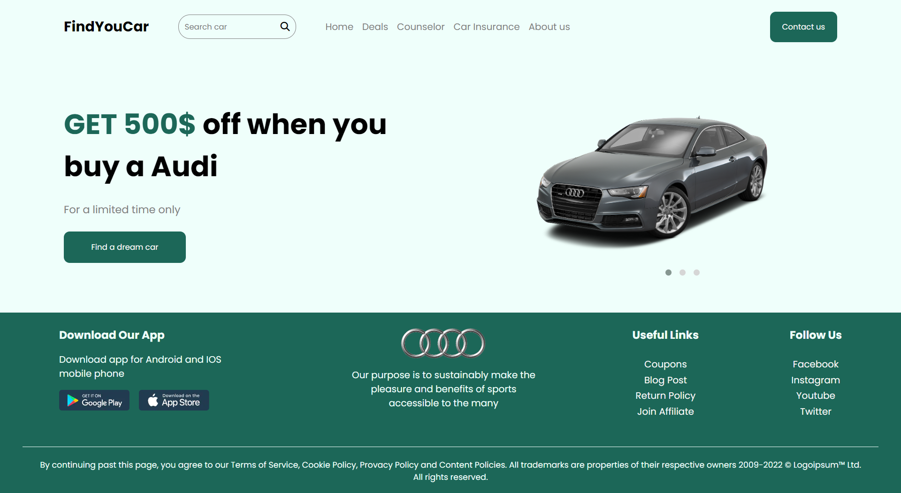
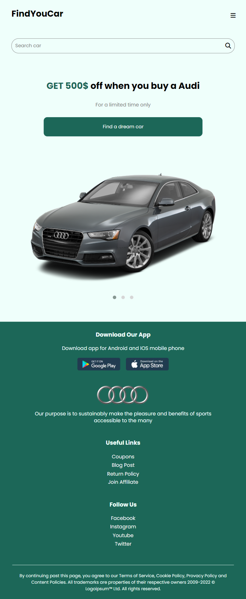

# Car Landing Page

The Car Landing Page is a visually appealing web page created to showcase a specific car or car collection. It is designed using HTML and CSS, serving as a practice project to enhance web development skills.

## Snapshots

## Screenshots


_desktop version_


_mobile view_

## Technologies Used

- HTML
- CSS

## Features

- Responsive design for optimal viewing on different devices.
- Stunning visual layout to showcase the car or car collection.
- Smooth animations and transitions for an engaging user experience.

## Getting Started

To get a local copy of the project up and running, follow these steps:

Clone the repository:
   ```bash
   git clone https://github.com/Bexst24/Car-Landing-Page.git
   ```
